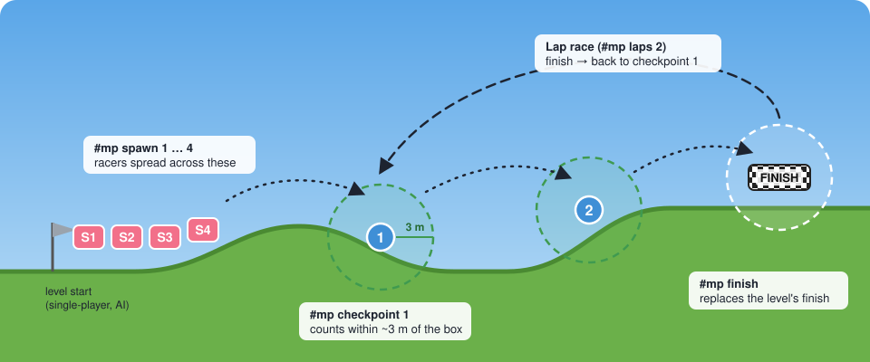
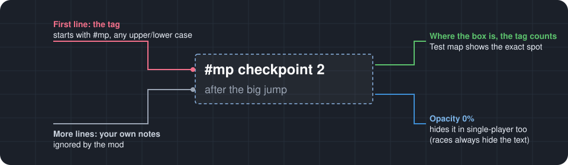

# Making multiplayer maps

Happy Wheels Multiplayer can race any level. You can also build a level **for** multiplayer with extra start positions, checkpoints, laps, a finish line of your own, time limits, a fixed character, survival mode and more. There's nothing extra to install. You use the normal Happy Wheels level editor and add a few **text boxes** that start with `#mp`.



- [Quick start](#quick-start)
- [How tags work](#how-tags-work)
- [Places: spawns, checkpoints, finish](#places-spawns-checkpoints-finish)
- [Rules](#rules)
- [Kinds of maps](#kinds-of-maps)
- [Templates to copy](#templates-to-copy)
- [Testing your map](#testing-your-map)
- [AI racers on your map](#ai-racers-on-your-map)
- [Publishing](#publishing)
- [Tips and gotchas](#tips-and-gotchas)

---

## Quick start

1. Build your level in the Happy Wheels editor as usual, including its normal start point.
2. Add a text box, type `#mp spawn 1`, and drag it to where the first racer should start. Add `#mp spawn 2`, `#mp spawn 3`… next to it, about a vehicle length apart.
3. Add a text box that says `#mp collisions on` (or `off`) anywhere in the level if you want to decide that for everyone.
4. Put **HWMP** in the level's name, for example *Canyon Sprint HWMP*, and publish it.
5. In the mod, press **F2**, then **Choose level… → Level ID**, enter your level's ID and click **Test map**. Every marker is drawn on screen and any mistakes are listed.

That's a working multiplayer map. The rest of this guide covers everything else you can do.

## How tags work



- A tag is a **text box** whose text starts with `#mp`. Upper and lower case don't matter: `#MP Spawn 1` works too.
- Use **one tag per text box**. Only the first line is read, so you can write notes to yourself on the lines below it.
- For places (spawns, checkpoints, the finish), **the text box's position is the spot**. Keep the text short so the box sits where you mean it, and use **Test map** to see exactly where the mod puts each marker.
- Rules (like `#mp laps 3`) can go anywhere in the level.
- **In races the text is always hidden.** To hide it in normal single-player play too, set the text box's opacity to 0%.
- Put tag text boxes directly in the level, **not inside a group**. Text boxes inside groups aren't read.
- Times can be written as `90`, `90s`, `1:30`, `2m` or `1m30s`.

## Places: spawns, checkpoints, finish

| Tag | What it does |
| --- | --- |
| `#mp spawn 1` | A start position. Add several and racers are spread across them instead of all starting on one spot. The numbers set the order: the first racer gets spawn 1, the second spawn 2, and so on. With more racers than spawns, they share. Unnumbered spawns come after the numbered ones, in the order you placed them. |
| `#mp checkpoint 1` | A checkpoint. A racer passes it by getting within about **3 m** of the text box (roughly 190 editor pixels). After that, pressing **R** respawns them there (the race clock keeps running). |
| `#mp finish` | Your own finish line, counted the same way (within about 3 m). It **replaces the level's normal finish**: touching the old one no longer ends the race. |

**Numbered or not?** If *every* checkpoint has a number, they must be passed in order: 1, then 2, then 3. If they have no numbers, they're just respawn points that can be reached in any order, and R takes you to the last one you touched. A map with a finish line or laps always uses the order.

In a race, a checkpoint shows as a blue circle, and the next one pulses green with its trigger area drawn around it. When the next checkpoint is off screen, it's pinned to the edge of the screen pointing the way. Players can turn these markers off in **Settings**.

## Rules

Rules override the lobby's settings on your map. The lobby shows them with a **map** badge so players know why a setting can't be changed.

| Tag | Values | What it does |
| --- | --- | --- |
| `#mp collisions on` | `on`, `off` | Whether racers bump into each other. |
| `#mp character segway` | a name or 1–11 | Everyone races as this character. Names: wheelchair guy, segway guy, irresponsible dad, effective shopper, moped couple, lawnmower man, explorer guy, santa claus, pogostick man, irresponsible mom, helicopter man. Part of a name is enough (`segway`, `santa`). |
| `#mp laps 3` | 1–20 | A circuit: pass every checkpoint in order, then the `#mp finish`, this many times. Needs a `#mp finish`. |
| `#mp time limit 3:00` | 10 s – 60 min | The race ends after this long. Racers who haven't finished are ranked by how far they got (laps and checkpoints). |
| `#mp finish window 60` | 5 s – 10 min | How long everyone else gets after the first racer finishes. |
| `#mp restart checkpoint` | `checkpoint`, `start`, `off` | What **R** does. `checkpoint` (the default) goes back to the last checkpoint, `start` always goes back to the start line, and `off` means no second chances. |
| `#mp countdown 5` | 2–15 seconds | Length of the start countdown. |
| `#mp ai off` | `on`, `off` | Whether AI racers may join. `#mp ai max 3` allows at most three (0–7). |
| `#mp ghosts 30` | 5–95 % | How visible other racers are when collisions are off. |
| `#mp players 4` | 1–16 | How many racers the map is made for. Bigger lobbies get a warning. |
| `#mp mode survival` | `race`, `survival` | Survival: the last racer alive wins. See below. |

If a rule appears twice, the first one counts and Test map warns you about the second.

## Kinds of maps

**Sprint (A to B).** Just add spawns. The level's own finish (its normal target or trigger) ends the race. You can add unnumbered checkpoints as respawn points for long or hard maps.

**Checkpoint trail.** Numbered checkpoints along the route force racers through each section (no shortcuts past checkpoint 2), and the standings show how far everyone is. Add `#mp finish` for your own finish line, or leave it out to keep the level's.

**Circuit.** A loop with `#mp laps 3`, numbered checkpoints around the track and a `#mp finish` on the start/finish straight. After each lap, R brings racers back to the finish line. Put at least one checkpoint on the far side of the loop, otherwise racers could sit on the finish line and rack up laps.

**Timed challenge.** `#mp time limit 2:00` on a long or near-impossible level: whoever gets furthest wins. Numbered checkpoints make "furthest" precise.

**Survival arena.** `#mp mode survival`: no restarts, and the last racer alive wins. If someone reaches a finish line, they win outright. A time limit ends a stalemate, and then the survivors place above the fallen. Collisions on make it a brawl. AI racers don't take part in survival.

## Templates to copy

Build the course in the editor, then add these text boxes.

**Two-lap circuit for up to 6 racers**
```
#mp spawn 1      #mp spawn 2      #mp spawn 3        (on the start straight, side by side)
#mp spawn 4      #mp spawn 5      #mp spawn 6
#mp checkpoint 1                                     (a third of the way round)
#mp checkpoint 2                                     (two thirds of the way round)
#mp finish                                           (just past the spawns)
#mp laps 2
#mp collisions on
#mp players 6
```

**Survival arena**
```
#mp spawn 1 … #mp spawn 8                            (spread out, well apart)
#mp mode survival
#mp collisions on
#mp time limit 3:00
#mp character pogostick man
```

**Hard obstacle course with respawns**
```
#mp spawn 1 … #mp spawn 4
#mp checkpoint 1 … #mp checkpoint 5                  (before each hard section)
#mp restart checkpoint
#mp finish window 2:00
#mp countdown 5
```

## Testing your map

You don't need friends online to test.

- **Test map**: in the level browser (F2 → Choose level…), open your level's details and click **Test map**, or use **Making multiplayer maps → Test your map** with the level ID. You play the level on your own with the race rules applied, and you see:
  - every spawn point (S1, S2…), checkpoint and finish line, with the area that counts,
  - a panel listing your map's rules and any **warnings**,
  - the lap and checkpoint counter at the top, just like in a race.
- **Practice** plays the level on your own against a ghost of your best run.
- The level details show an **HWMP** badge and what players get, for example *2 laps · 4 start positions · 3 checkpoints · collisions on*. If that line is missing, the mod found no tags.

Warnings you might see:

| Warning | Fix |
| --- | --- |
| Unknown tag "#mp …" | A typo. Check the spelling against the tables above. |
| Unknown character "…" | Use a name from the list or a number from 1 to 11. |
| … must be between … | The value is out of range. The range is in the message. |
| Repeats a rule that's already set | Two text boxes set the same rule. Delete one. |
| Laps need a "#mp finish" | Add a finish text box, or remove the laps tag. |
| A lap race needs at least one checkpoint | Add a numbered checkpoint on the far side of the loop. |
| Survival maps never allow restarts | Remove the `#mp restart` tag, it has no effect in survival. |
| Two spawn points are almost on top of each other | Move them at least a vehicle length apart. |
| Two checkpoints have the same number | Renumber them 1, 2, 3… |

On your own, R always works (even on maps with `#mp restart off`) so you're never stuck while testing.

## AI racers on your map

AI racers drive **real replays** people uploaded for your level, so:

- Upload a replay or two of your own runs after publishing. The more replays there are, the more AI difficulties can be filled.
- Or race your map once and add an AI racer set to **Your best**: it drives your personal best run.
- AI racers start from the level's normal start point and follow the level's own finish, so they sit out maps with `#mp finish` or `#mp laps`, and survival maps. `#mp ai off` keeps them out of any map.

## Publishing

- Put **HWMP** in the level name. The mod's **Multiplayer maps** tab lists every level with HWMP in its name.
- Say in the description how many players it's for and what kind of race it is ("2-lap circuit, collisions on, 2–6 players").
- Keep the level's normal start point and finish working, so the level is still fun in single-player and AI racers can use it (when your rules allow them).

## Tips and gotchas

- **R restarts the level.** Anything that moved (crates, doors, triggered objects) goes back to how it started, even when R respawns you at a checkpoint. Place checkpoints so the route from them still works from a freshly started level.
- **Checkpoints count where the rider is**, within about 3 m. Put them on the path everyone has to take, not above a jump most people clear.
- Spawns closer than about a vehicle length apart can make racers collide right at the start. Racers pass through each other until they've separated, but spacing them out still looks better.
- A spawn slightly above the ground is fine. Racers drop onto it.
- Triggers that point at a tag's text box keep working, because the mod only blanks the text and never removes the box.
- Test with **collisions on and off** if you don't set it yourself: lobbies can choose either.
